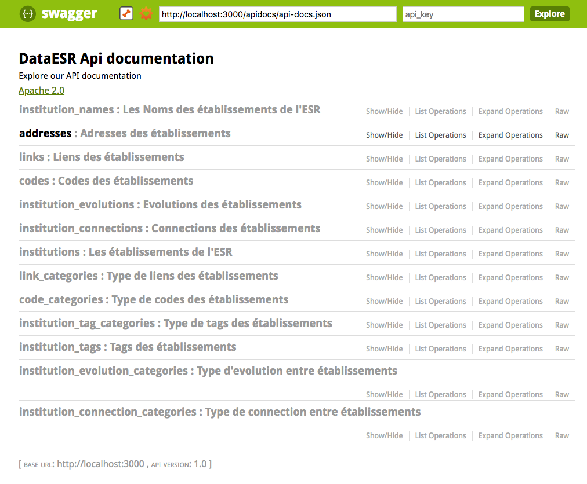

[](https://travis-ci.com/pierrax/EsrBackend)
# DataESR Institutions

DataESR Institutions is a Rails open source application to manage higher education institutions and expose data through a REST API. 


### Ruby version

2.4.0

### Installation

First, clone down the repository:

    git clone https://github.com/MinistereSupRecherche/data_esr_institutions && cd data_esr_institutions

Update dependencies, run:

    bundle install

Create database, run:

    rake db:create

Run migrations:

    rake db:migrate
    
Populate database, run:
     
     rake db:seed
    
Environment variables, add a ```.env``` file to the root, with:

    DOMAIN_URL=http://localhost:3000
    CHECK_TOKEN_URL=my_auth_application_url
    

### Launch 

In a console, launch the Rails server, run :

    rails s

That's it !

### Database schema

To generate a db diagram, run:

    bundle exec erd

### API documentation

Visit ```http://localhost:3000/api``` :



### Dependencies

##### Authentification

You need to add an authentification application in order to successfully authenticate your requests.
Please check: https://github.com/MinistereSupRecherche/data_esr_authenfication

##### Front-end

Please check: 
